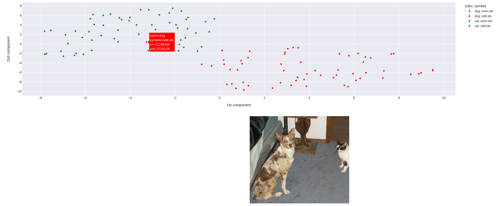
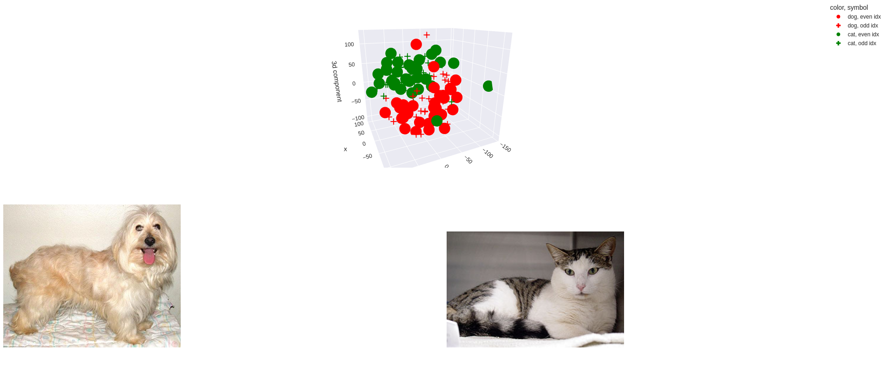

# embedding_inspector
Simple application/library to visualize and inspect TSNE embeddings using Plotly and Dash.


## Installation
### `pip`:
```bash
pip install 'git+https://github.com/NilsHasNoGithub/embedding_inspector'
```
### `pipenv`
```bash
pipenv install 'git+https://github.com/NilsHasNoGithub/embedding_inspector#egg=embedding_inspector'
```

### `poetry`
```bash
poetry add 'git+https://github.com/NilsHasNoGithub/embedding_inspector'
```


## Code example

Example usage (See `examples` folder for more details):
```python
@lru_cache
def get_dinov2_model() -> torch.nn.Module:
    return torch.hub.load("facebookresearch/dinov2", "dinov2_vits14")


def load_image(uid: str) -> pil_img.Image:
    img = pil_img.open(uid)
    img.load()
    return img


def load_embedding(uid: str) -> np.ndarray:
    model = get_dinov2_model()
    img = load_image(uid)
    img_t = TRANSFORM(img)

    embed = model(img_t[None, :, :, :])
    return embed[0, ...].detach().cpu().numpy()


dog_imgs = [str(p) for p in Path("data", "dog").glob("*.jpg")]
cat_imgs = [str(p) for p in Path("data", "cat").glob("*.jpg")]

unique_ids = dog_imgs + cat_imgs

# Labels to show in the scatter plot
labels = ["dog" for _ in dog_imgs] + ["cat" for _ in cat_imgs]

# The app supports 2 labels, 1 for the color and 1 for the shape
# The second label added here is just to demonstrate the possiblity
other_labels = ["even idx" if i %2 == 0 else "odd idx" for i in range(len(labels))]

combined_labels = list(zip(labels, other_labels))

# By default PCA with 50 components + TSNE with 2 components is used, though this can be modified.
# 3d is also supported! Though for this example 3d reduces interpretability
def custom_dim_reduction_fn(x: np.ndarray) -> np.ndarray:
    return TSNE(n_components=3).fit_transform(PCA(n_components=10).fit_transform(x))

run_embedding_inspection_app(
    unique_ids,
    combined_labels,
    load_embedding,
    load_image,
    dim_reduction_fn=custom_dim_reduction_fn,
    tag="dogs and cats",
    dash_app_run_kwargs=dict(port=5050),
    scatter_fig_kwargs=dict(color_discrete_sequence=["red", "green"], symbol_sequence=['circle', 'cross'], opacity=1.0) # Species is now indicated by green/red, and even/odd idx by circle/cross
)
```


## Interface examples

### 2D


### 3D
